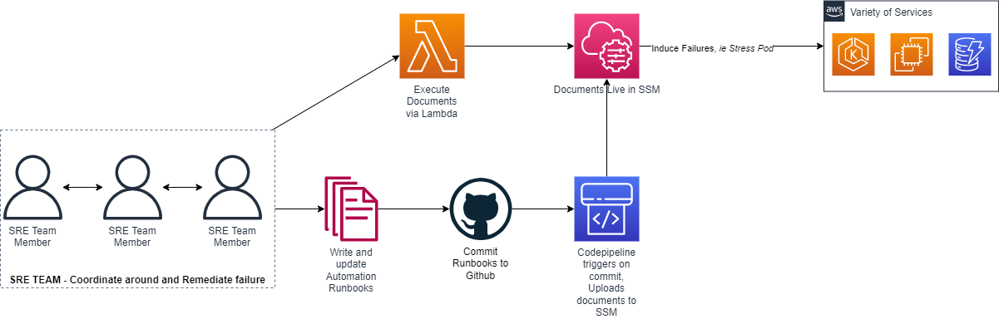

# Game Day Foundations Blueprint

### This repository holds the CDK code for the Game Day Foundations Blueprint.

This blueprint comprises of a pipeline to upload SSM Documents to AWS, a set of SSM documents for testing purposes, as well as a lambda to execute SSM Automation documents.


## Installation Guide
First, clone the repository.

`git clone https://github.com/VerticalRelevance/gameday-foundations.git`

Make sure that you have python3 installed on your machine. You can install it following [these instructions](https://www.python.org/downloads/). 

There are two separate CDK applications to deploy within this repository, a pipeline and a Lambda function. We will begin with the pipeline.

## Pipeline Instructions (talk about creating the pipeline thru code)

The pipeline is created through CDK, which will allow the user to easily deploy this pipeline in whichever account necessary. The pipeline configuration can be edited via the CDK code. This part of the readme will walk you through the steps of deploying the pipeline via CDK, as well as how to use the pipeline.

In order to deploy the pipeline, first navigate to the pipeline subfolder.

```
cd pipeline_cdk
```

Next, create a virtual environment, and then activate it. 

```
python3 -m venv./venv
source venv/bin/activate
```

Once you have created and activated the virtual environment, install the requirements for the project.

```
pip3 install -r requirements.txt
```

Now that the requirements have been installed, you can deploy the pipeline via cdk.

First, bootstrap the environment with `cdk bootstrap`. Now you can deploy the app for this blueprint:

```
cdk deploy
```

This will create the pipeline for you. Once the pipeline has been created, you can add runbooks to `runbooks` folder in the root of the 
repository. Any commit will trigger the pipeline. The build stage of the pipeline will update existing documents with changes or upload new documents. In addition, this pipeline will renumber the version of your SSM Automation Document, so you do not need to manually edit the version using the AWS Console or CLI. The build stage will fail if a commit is made and no documents are updated or added to the repository.

Please note, the script provided here is adapted for use with YAML SSM Automation documents, but can easily be configured for JSON documents. 

Once your documents are uploaded to SSM via the CDK pipeline, you can deploy the second CDK Application, the lambda.

## Lambda Execution Instructions

The second CDK Application concerns a lambda which is used to execute the documents uploaded via the pipeline section. Once again, as mentioned, the lambda is deployed via CDK, and is configured through the CDK code as well as the lambda handler, both present in the repository.

In order to execute the documents via lambda, you must deploy the lambda via CDK. This part of the readme will walk you through the steps of deploying and executing via CDK and Lambda, respectively.

First, navigate to the gameday_lambda directory:

```
cd gameday_lambda
```

Once here, follow the same steps as above to deploy the lambda via CDK. 

```
python3 -m venv./venv
source venv/bin/activate
pip3 install -r requirements.txt
cdk bootstrap
cdk deploy
```

You can then locate the `GameDayLambda` function in the AWS Console of the account you deployed it in. 

Inside of the lambda, you can run a specific runbook by giving as input the name of a Runbook in the account, and the IAM role for the document to assume :

```
{
  "runbook_name": "example_runbook",
  "automation_assume_role": "arn:aws:iam::..."
}
```
